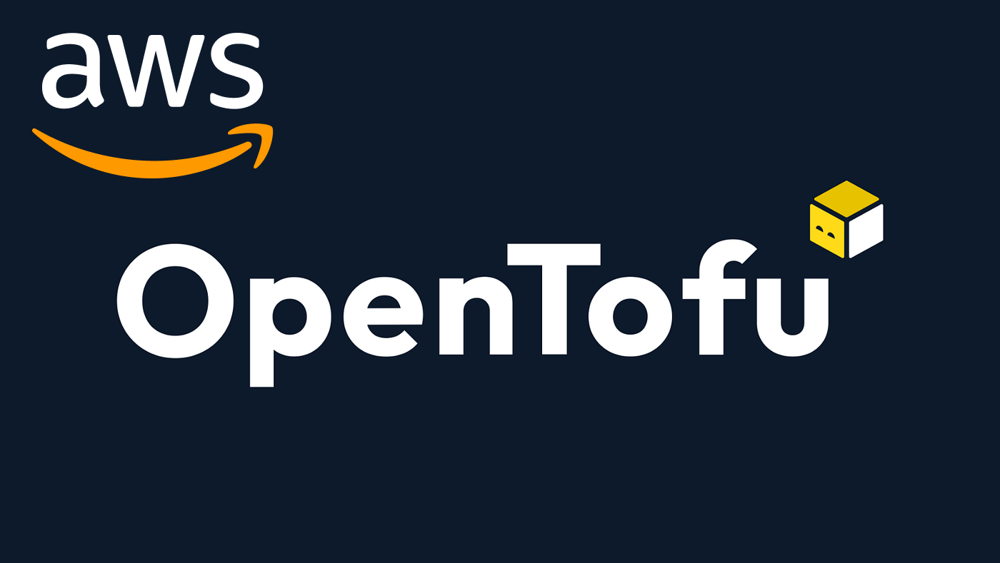

<h1 align="center"> Container Orchestration System <h1>
<br/>


  


<br/>
<br/>

- [**Introduction**](#introduction)
- [**Requirements Tools**](#requirements-tools)
- [**Optional Tools**](#optional-tools)
- [**Usage**](#usage)
- [**Pull Requests**](#pull-requests)
- [**Issues**](#issues)

## Introduction
This project is a container orchestration system, that is using AWS ECS and we adding EKS  in Future.

## Requirements
you need install all the tools below:
- [opentofu](./docs/requirements/opentofu.md) - tools for provisioning and managing cloud infrastructure 
- [aws cli](./docs/requirements/aws-cli.md) - command-line tool for AWS 

## Optional Tools
- [aws-vault](./docs/requirements/aws-vault.md) - a tool to securely store and access AWS credentials in a development environment
- [pre-commit](./docs/requirements/pre-commit.md) - a framework for managing and maintaining multi-language pre-commit hooks
- [tflint](./docs/requirements/tflint.md) - a Terraform linter for detecting errors that can not be detected by terraform plan
- [terraform-docs](./docs/requirements/terraform-docs.md) - a tool to generate documentation from Terraform modules in various output formats

## Usage
To use this project, follow these steps:
1. Clone this repository:
```bash
git clone git@github.com:AlphaEzops/aws-container-service.git
```
2. Set AWS credentials as environment variables:
```bash
aws-vault exec <profile> -- env | grep AWS
```
3. Initialize Terraform:
```bash
make init
```
4. Create a Terraform plan:
```bash
make plan
```
5. Apply the Terraform plan:
```bash
make apply
```

## Pull Requests
If you find a bug or want to add an improvement to this project, feel free to open a pull request.

## Issues
If you have any questions or difficulties with this project, please open an issue.
